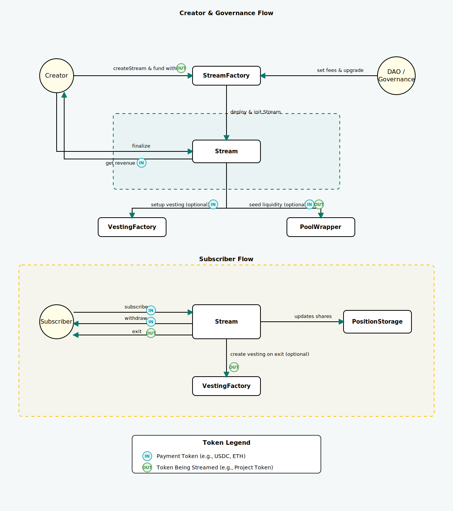

# StreamSwap ‖ EVM Smart Contracts

[](https://github.com/StreamSwapProtocol/streamswap-solidity/releases/latest)


## Overview

[StreamSwap](https://www.streamswap.io) is a protocol for **continuous, time-based token swaps**.  
Projects, DAOs and users can create *streams* – mechanically similar to an LBP – that last for a configurable period. While the stream is live participants gradually swap an **in-supply** token for an **out-supply** token. Pricing continuously evolves in real time based on demand rather than being fixed up-front.

The code in this repository is the **EVM implementation** of StreamSwap.  
If you are looking for the original CosmWasm contracts check the [`streamswap-contracts`](https://github.com/StreamSwapProtocol/streamswap-contracts) repo instead.

---

## Architecture

StreamSwap on EVM is fully modular and upgradeable. The core pieces are:

| Contract | Description |
|----------|-------------|
| [`StreamFactory.sol`](src/StreamFactory.sol) | Creates new streams and stores global protocol parameters (fees, accepted tokens, etc.). |
| [`StreamCore.sol`](src/StreamCore.sol), [`StreamBasic.sol`](src/StreamBasic.sol), [`StreamPostActions.sol`](src/StreamPostActions.sol) | Core stream logic with different feature sets (basic vs advanced with vesting/pools). |
| [`PoolWrapper.sol`](src/PoolWrapper.sol) | Helper that interfaces with external AMMs (Uniswap V2/V3, Aerodrome) to seed post-sale liquidity. |
| [`PositionStorage.sol`](src/storage/PositionStorage.sol) | ERC-721 style storage of per-user positions for gas-efficient bookkeeping. |
| [`VestingFactory.sol`](src/VestingFactory.sol) | Deploys linear vesting contracts for creators and/or beneficiaries when enabled. |
| **Libraries & Interfaces** | Math utilities, custom errors and typed structs that keep byte-code size minimal.

A high-level diagram is shown below (simplified – one Stream instance illustrated):



### Stream Lifecycle

| Phase | Duration | Description | User Actions |
|-------|----------|-------------|--------------|
| **Waiting** | Variable | Stream created, not yet open | Creator can cancel and get refund |
| **Bootstrapping** | ≥ minBootstrappingDuration | Users can subscribe | Subscribe, Withdraw |
| **Active** | Variable | Live streaming | Subscribe, Withdraw |
| **Ended** | Indefinite | Stream concluded | Exit, Finalize |
| **Finalized** | Permanent | Stream closed | Exit |

---

## How to Interact with StreamSwap

This section provides a practical guide for the most common interactions with the protocol.

### Prerequisites
- A Web3 wallet (e.g., MetaMask).
- Native tokens for gas fees on your chosen network.
- The relevant `in-supply` or `out-supply` tokens for interacting with a stream.

### Connecting to the Protocol

Before you can interact with streams, you need to connect to the `StreamFactory` contract.

```javascript
import { ethers } from "ethers";
import StreamFactoryAbi from "./abi/StreamFactory.json";
import StreamAbi from "./abi/Stream.json";

// Setup your provider and signer
const provider = new ethers.providers.Web3Provider(window.ethereum);
const signer = provider.getSigner();

// 1. Connect to the Factory
const streamFactoryAddress = "0x..."; // Get address from the Reference section
const streamFactory = new ethers.Contract(streamFactoryAddress, StreamFactoryAbi, signer);

// 2. Get a Stream instance (e.g., by tracking StreamCreated events)
const streamAddress = "0x...";
const stream = new ethers.Contract(streamAddress, StreamAbi, signer);
```

### Common Actions

Here are the most common actions you can perform, with examples for both the CLI and a JavaScript environment.

| Action | CLI Command (for quick tests) | JavaScript Integration |
| :--- | :--- | :--- |
| **Create a Stream** | `yarn create-stream` | `const tx = await streamFactory.createStream(params);`<br/>*See parameter reference below.* |
| **Subscribe** | `yarn subscribe --stream <addr> --amount 1.0` | `const tx = await stream.subscribe(ethers.parseEther("1.0"));` |
| **Withdraw** | `yarn withdraw --stream <addr> --amount 0.5` | `const tx = await stream.withdraw(ethers.parseEther("0.5"));` |
| **Exit** | `yarn exit-stream --stream <addr>` | `const tx = await stream.exitStream();` |
| **Finalize** | `yarn finalize-stream --stream <addr>` | `const tx = await stream.finalizeStream();` |
| **Check Status** | `yarn get-stream-status --stream <addr>` | `const status = await stream.getStreamStatus();` |

---

## Getting Started (Development)

### Prerequisites

*   Node ≥ 18.18.0
*   Yarn Classic (v1) or pnpm

### Install & Compile

```bash
git clone https://github.com/StreamSwapProtocol/streamswap-solidity.git
cd streamswap-solidity
yarn install
yarn compile
```

### Local Testnet Workflow

```bash
# 1. Start a local hardhat node
yarn chain

# 2. Deploy core contracts to the local network (in a new terminal)
yarn deploy

# 3. Run unit & integration tests
yarn test
```

---

## Deployment Instructions

### 1. Environment Setup
Create a `.env` file from the `.env.example` template and add your `RPC_URL` and `PRIVATE_KEY` values.

### 2. Deploy Core Contracts
```bash
# Deploy to a testnet
yarn deploy --network sepolia

# Deploy to mainnet
yarn deploy --network mainnet
```

### 3. Post-Deployment Verification
```bash
# Verify contracts on Etherscan
yarn hardhat verify --network sepolia DEPLOYED_ADDRESS ...constructor_args
```

---

## Reference

### Function Parameters

#### Stream Creation (`createStream`)
| Parameter | Type | Description |
|-----------|------|-------------|
| `creator` | address | Stream creator address |
| `inSupplyToken` | address | Input token for subscriptions |
| `outSupplyToken` | address | Output token being streamed |
| `streamOutAmount` | uint256 | Total tokens to stream |
| `threshold` | uint256 | Minimum participation required |
| `bootstrappingStartTime` | uint256 | When bootstrapping phase starts |
| `streamStartTime` | uint256 | When streaming begins |
| `streamEndTime` | uint256 | When streaming ends |
| `...` | | *See `StreamTypes.sol` for full struct* |

#### Factory Initialization (`initialize`)
| Parameter | Type | Description |
|-----------|------|-------------|
| `streamCreationFee` | uint256 | Fee to create a stream |
| `exitFeeRatio` | Decimal | Fee ratio for exits |
| `minWaitingDuration`| uint256 | Minimum waiting period |
| `feeCollector` | address | Address to receive fees |
| `...` | | *See `StreamFactoryTypes.sol` for full struct* |

### Deployed Addresses

| Network | StreamFactory |
|---------|---------------|
| Sepolia | `0x6111D0a8E71cc27a2Af70A41965409ceDf11d960` |
| Base Sepolia | `0x0012D05976DfD6383432146Dd9970bA7BC7dc733` |
| Monad Mainnet | `0x2B3Db98aC7De966AE2422b26FB887870633C6E28` |
| Hyperliquid Testnet | `0xa2bc94F53F7eC7C73EC13BB771dcbfb0DCEDe47B` |

> **Note**: addresses may change – always check the latest release artifacts.
---

## Security

Third-party security audits are conducted regularly. Audit reports are available in the [audits](./audits/) directory when completed.

---

## License

Licensed under [Apache 2.0](./LICENSE).